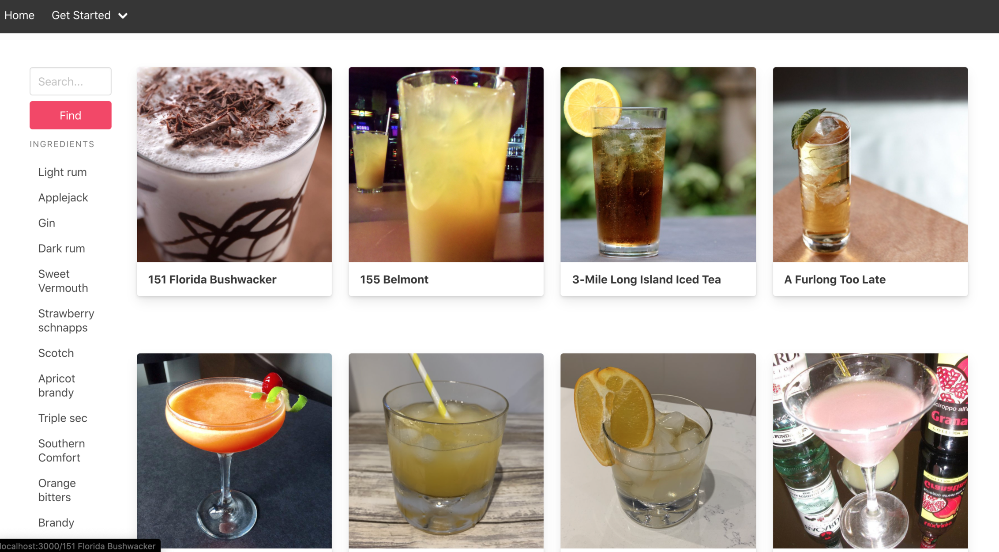

# Three-Shots-Of

## Overview 
This is my first project using the React framework, and the main theme in this project is to allow user to find the cocktail they wish to know more about.

In the web app, users will able to to have cocktail suggestion base on their mood. Not on this, users are able to search cocktail by the first letters, base alcohol and similar names. All these features allow different type of users to use our web app, making a more user friendly app.

This web app also a collaborative efforts.

### Collaborator:
Lilian Monza -> [Github](https://github.com/Saintmonza?tab=repositories)

## Brief
- This is a multi page web app 
- Consume of third party [API](https://www.thecocktaildb.com/api.php)
- Using semantic markups in HTML
- Using Bulma CSS and SCSS technique

## Timeframe and Technology 
### Timeframe: 7 days

### Technology 

#### Front End:
- React
- HTML and CSS
- SASS
- Bulma 
- Axios
- Yarn
- Create React App
- [Coctail DB](https://www.thecocktaildb.com/api.php)

#### Dev Tools:
- Chrome Devs Tool
- Post man
- VSCode
- Git 
- Github
- Git Branch

## Install instructions:
- Clone the repo.
- Copy the command line from Git Hub then past it into terminal.
- Type 'Yarn install'
- Once installed type 'Yarn start' to load the app inside of your browser

## Approach Taken 
- Me and my partner first plan the basic wire framing what our app should be. We both gave ideas how we would like to use the web app. This help us to land on our first basic wire framing.
   - This is initially wire framing during planning phase:
     
     
- Then we moved on to work on the how the web layout should look like. This is particularly challenging as we do not have much idea how do we consider web app as professional. However, we look through multiple professional website and learning what is needed.
   - This is the wire framing for how our app should look like:
     
     
     
     

- After wire framing, we started coding by pair-coded using VScode live server. We work together to make sure that the API works and read through the API documentation. In our case, our public API doesn't require any authentication process to get the API information. Hence, we are happy working with the API we have.

- To make an agile and effecient work environment, we make use of git branch and making sure that commit's comments must be as detailed as we can so we can always update what we are doing.

- I was responsible for working on the API call, it was able to use axios library to call the API. I also make use of asynchronous principle when working on the UI components.

- We also worked on the 'Cocktail Page' together, as the cocktail page was more complicated then others. We got trouble where one of the list wasn't showing up. Then we both worked our way through the problem.
  ```
  const Links = ({ array }) => {
    return array.map((item) => {
      return (
        <li key={item.strDrink}>
          <a href={`/cocktailName/${item.strDrink}`} className={item.strDrink}>
            {item.strDrink}
          </a>
        </li>
      );
    });
  };

  const CocktailName = () => {
    const { drink = "Mojito" } = useParams();
    const history = useHistory();

    const [state, setState] = React.useState();
    const [search, setSearch] = React.useState("");

    const fetchingListofCocktails = async () => {
      try {
        const res = await filterByAlcohol(drink);
        setState(res.data.drinks);
      } catch (err) {
        console.error(err);
      }
    };

    const handleChange = (e) => {
      setSearch(e.target.value);
    };

    const handleSubmit = (e) => {
      e.preventDefault();
      history.push(`/cocktailname/${search}`);
      window.location.reload(false);
    };

    React.useEffect(() => {
      fetchingListofCocktails();
    }, []);
    console.log(state);
    return(...)
    }
  ```
  
- Then, we styled it with bulma and SCSS. I also reorganised the code by seperating some unnecessary long files into different sections. e.g splitting the showing the cockctail page into cocktail cards. This made the code much more readable. 
- In addition, I added some animation to the home page where user click the button intructions it will lead to the instruction page with smooth transition. This gave me the opportunity to learn more different react hooks.

```
const Home = () => {
  const instructions = useRef(null);

  const handleClick = (e) => {
    e.preventDefault();

    const ref = instructions;

    ref.current.scrollIntoView({ behavior: "smooth" });
  };
  return (...)
```

## End Result:



## Wins 
- Through this projects, I'm able to make use of git branch to give agile environments for working with teammate.
- We managed to always planning ahead so we never lose track of our tasks and goal through proper communication.

## Challenges
- The main challenge I faced in this project is choosing the correct API to use. Due to high volume of public API it is always hard to choose the correct or the one that suits your project. To get over this hurdle, we go through criteria by criteria to find out what is the best API to use. Again this is all about communication and teamwork.
- One challenge I faced during this project is having to explain certain code to my teammate. To overcome this, I always make sure to comment every section of my code to make sure my teammate stay on tune with me:
  ```
  // Base URL
  const BaseURL = "https://www.thecocktaildb.com/api/json/v1/1/";

  /* This is for the filtering api */

  // Getting cocktail drinks by certain base ingredient e.g gin
  export const filterByIngredient = (Ingredient) => {
    return axios.get(`${BaseURL}filter.php?i=${Ingredient}`);
  };

  // Getting cocktail drinks by letters
  export const filterByLetters = (Letter) => {
    return axios.get(`${BaseURL}search.php?f=${Letter}`);
  };

  // Getting cocktail drinks by specific drinks e.g Bloody Mary
  export const filterByAlcohol = (Drink) => {
    return axios.get(`${BaseURL}search.php?s=${Drink}`);
  };
  ```
## Learning Process
- From this project I learnt to use axios effectively and using asynchronous functions or method. 
- Learnt to use third party API with or without authentication.
- Making use of post man to test out API call.
- Time management and good communication to ensure we reach our goal in a short time frame. Learning to plan effeciently and making use of git branch concept.

## Future Developement:
- Deploy into actual website and allow access for users.
- Allowing recomendation cocktails when user in the one cocktail description page.
